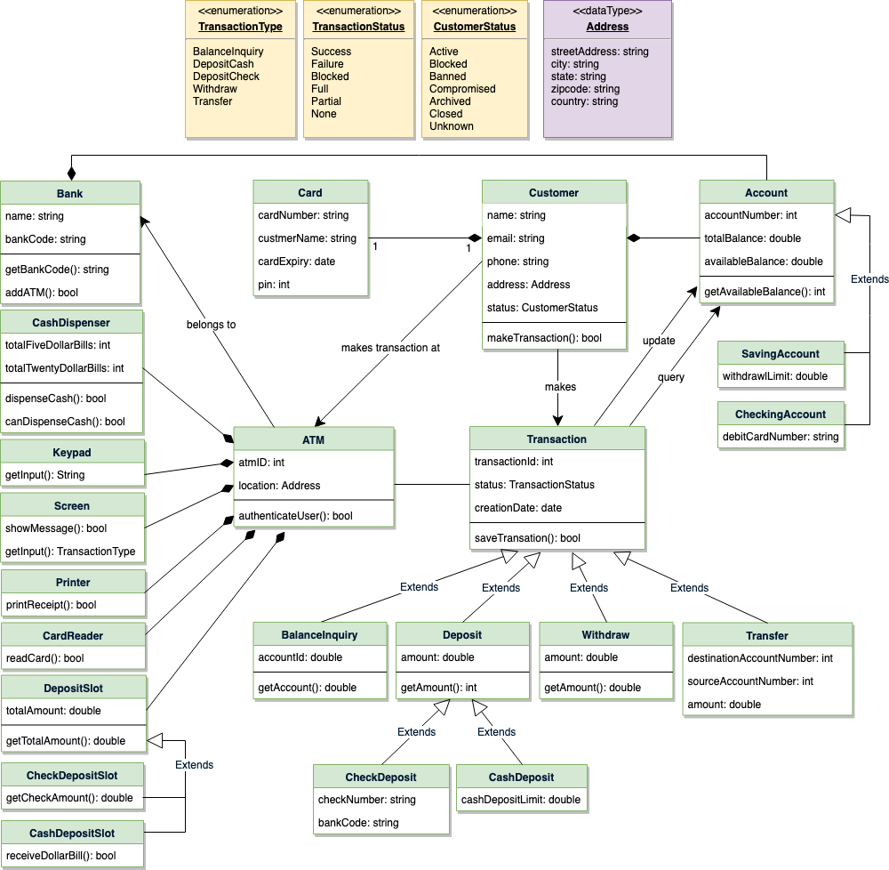
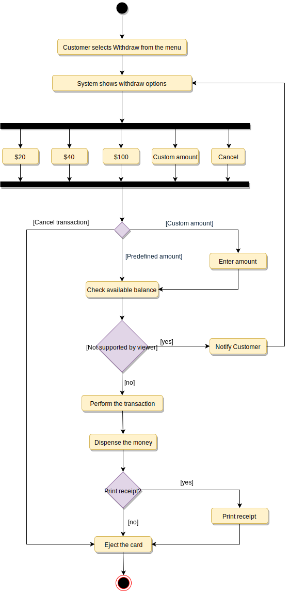

# Design an ATM

[Design an ATM - Grokking the Object Oriented Design Interview (educative.io)](https://www.educative.io/courses/grokking-the-object-oriented-design-interview/m22LWKgQ4Wr)

[toc]

An automated teller machine (ATM) is an electronic telecommunications instrument that provides the clients of a financial institution with access to financial transactions in a public space without the need for a cashier or bank teller. ATMs are necessary as not all the bank branches are open every day of the week, and some customers may not be in a position to visit a bank each time they want to withdraw or deposit money.

## Requirements and Goals of the System

The main components of the ATM that will affect interactions between the ATM and its users are:

1. **Card reader:** to read the users’ ATM cards.
2. **Keypad:** to enter information into the ATM e.g. PIN. cards.
3. **Screen:** to display messages to the users.
4. **Cash dispenser:** for dispensing cash.
5. **Deposit slot:** For users to deposit cash or checks.
6. **Printer:** for printing receipts.
7. **Communication/Network Infrastructure:** it is assumed that the ATM has a communication infrastructure to communicate with the bank upon any transaction or activity.

The user can have two types of accounts: 1) Checking, and 2) Savings, and should be able to perform the following five transactions on the ATM:

1. **Balance inquiry:** To see the amount of funds in each account.
2. **Deposit cash:** To deposit cash.
3. **Deposit check:** To deposit checks.
4. **Withdraw cash** To withdraw money from their checking account.
5. **Transfer funds:** To transfer funds to another account.

## How ATM works?

The ATM will be managed by an operator, who operates the ATM and refills it with cash and receipts. The ATM will serve one customer at a time and should not shut down while serving. To begin a transaction in the ATM, the user should insert their ATM card, which will contain their account information. Then, the user should enter their Personal Identification Number (PIN) for authentication. The ATM will send the user’s information to the bank for authentication; without authentication, the user cannot perform any transaction/service.

The user’s ATM card will be kept in the ATM until the user ends a session. For example, the user can end a session at any time by pressing the cancel button, and the ATM Card will be ejected. The ATM will maintain an internal log of transactions that contains information about hardware failures; this log will be used by the ATM operator to resolve any issues.

1. Identify the system user through their PIN.
2. In the case of depositing checks, the amount of the check will not be added instantly to the user account; it is subject to manual verification and bank approval.
3. It is assumed that the bank manager will have access to the ATM’s system information stored in the bank database.
4. It is assumed that user deposits will not be added to their account immediately because it will be subject to verification by the bank.
5. It is assumed the ATM card is the main player when it comes to security; users will authenticate themselves with their debit card and security pin.

## Use cases

Here are the actors of the ATM system and their use cases:

**Operator:** The operator will be responsible for the following operations:

1. Turning the ATM ON/OFF using the designated Key-Switch.
2. Refilling the ATM with cash.
3. Refilling the ATM’s printer with receipts.
4. Refilling the ATM’s printer with INK.
5. Take out deposited cash and checks.

**Customer:** The ATM customer can perform the following operations:

1. Balance inquiry: the user can view his/her account balance.
2. Cash withdrawal: the user can withdraw a certain amount of cash.
3. Deposit funds: the user can deposit cash or checks.
4. Transfer funds: the user can transfer funds to other accounts.

**Bank Manager:** The Bank Manager can perform the following operations:

1. Generate a report to check total deposits.
2. Generate a report to check total withdrawals.
3. Print total deposits/withdrawal reports.
4. Checks the remaining cash in the ATM.

Here is the use case diagram of our ATM system:


ATM use case diagram

## Class diagram

Here are the main classes of the ATM System:

- **ATM:** The main part of the system for which this software has been designed. It has attributes like ‘atmID’ to distinguish it from other available ATMs, and ‘location’ which defines the physical address of the ATM.
- **CardReader:** To encapsulate the ATM’s card reader used for user authentication.
- **CashDispenser:** To encapsulate the ATM component which will dispense cash.
- **Keypad:** The user will use the ATM’s keypad to enter their PIN or amounts.
- **Screen:** Users will be shown all messages on the screen and they will select different transactions by touching the screen.
- **Printer:** To print receipts.
- **DepositSlot:** User can deposit checks or cash through the deposit slot.
- **Bank:** To encapsulate the bank which ownns the ATM. The bank will hold all the account information and the ATM will communicate with the bank to perform customer transactions.
- **Account:** We’ll have two types of accounts in the system: 1)Checking and 2)Saving.
- **Customer:** This class will encapsulate the ATM’s customer. It will have the customer’s basic information like name, email, etc.
- **Card:** Encapsulating the ATM card that the customer will use to authenticate themselves. Each customer can have one card.
- **Transaction:** Encapsulating all transactions that the customer can perform on the ATM, like BalanceInquiry, Deposit, Withdraw, etc.



Class diagram for ATM


## Activity Diagram

**Customer authentication:** Following is the activity diagram for a customer authenticating themselves to perform an ATM transaction:


Activity Diagram - Customer Authentication

**Withdraw:** Following is the activity diagram for a user withdrawing cash:


Activity Diagram - Cash Withdraw

**Deposit check:** Following is the activity diagram for the customer depositing a check:



Activity Diagram - Deposit Check

**Transfer:** Following is the activity diagram for a user transferring funds to another account:


Activity Diagram - Transfer funds

## Sequence Diagram

Here is the sequence diagram for balance inquiry transaction:

![svg viewer](data:image/svg+xml;base64,PD94bWwgdmVyc2lvbj0iMS4wIiBlbmNvZGluZz0idXRmLTgiIHN0YW5kYWxvbmU9Im5vIj8+PCFET0NUWVBFIHN2ZyBQVUJMSUMgIi0vL1czQy8vRFREIFNWRyAyMDAxMDkwNC8vRU4iICJodHRwOi8vd3d3LnczLm9yZy9UUi8yMDAxL1JFQy1TVkctMjAwMTA5MDQvRFREL3N2ZzEwLmR0ZCI+PHN2ZyB4bWxucz0iaHR0cDovL3d3dy53My5vcmcvMjAwMC9zdmciIHdpZHRoPSIxMDk3IiBoZWlnaHQ9IjUwNiIgeG1sbnM6eGxpbms9Imh0dHA6Ly93d3cudzMub3JnLzE5OTkveGxpbmsiPjxzb3VyY2U+PCFbQ0RBVEFbVGl0bGU6IEJhbGFuY2UgSW5xdWlyeSBUcmFuc2FjdGlvbgpDdXN0b21lci0+QVRNOiBnZXRCYWxhbmNlKEFjY291bnQpCkFUTS0+VHJhbnNhY3Rpb246IGJhbGFuY2VJbnF1aXJ5VHJhbnNhY3Rpb24oQWNjb3VudCkKVHJhbnNhY3Rpb24tPkFjY291bnQ6IGdldEJhbGFuY2UoKQpBY2NvdW50LT5DaGVja2luZ0FjY291bnQ6IGdldEJhbGFuY2UoKQpDaGVja2luZ0FjY291bnQtLT5BY2NvdW50OiBCYWxhbmNlCkFjY291bnQtLT5UcmFuc2FjdGlvbjogQmFsYW5jZQpUcmFuc2FjdGlvbi0tPkFUTTogQmFsYW5jZQpBVE0tPlNjcmVlbjogZGlzcGxheU1lc3NhZ2UoQmFsYW5jZSkKU2NyZWVuLS0+Q3VzdG9tZXI6IHNob3dNZXNzYWdlKCldXT48L3NvdXJjZT48ZGVzYz5CYWxhbmNlIElucXVpcnkgVHJhbnNhY3Rpb248L2Rlc2M+PGRlZnM+PG1hcmtlciB2aWV3Qm94PSIwIDAgNSA1IiBtYXJrZXJXaWR0aD0iNSIgbWFya2VySGVpZ2h0PSI1IiBvcmllbnQ9ImF1dG8iIHJlZlg9IjUiIHJlZlk9IjIuNSIgaWQ9Im1hcmtlckFycm93QmxvY2siPjxwYXRoIGQ9Ik0gMCAwIEwgNSAyLjUgTCAwIDUgeiI+PC9wYXRoPjwvbWFya2VyPjxtYXJrZXIgdmlld0JveD0iMCAwIDkuNiAxNiIgbWFya2VyV2lkdGg9IjQiIG1hcmtlckhlaWdodD0iMTYiIG9yaWVudD0iYXV0byIgcmVmWD0iOS42IiByZWZZPSI4IiBpZD0ibWFya2VyQXJyb3dPcGVuIj48cGF0aCBkPSJNIDkuNiw4IDEuOTIsMTYgMCwxMy43IDUuNzYsOCAwLDIuMjg2IDEuOTIsMCA5LjYsOCB6Ij48L3BhdGg+PC9tYXJrZXI+PC9kZWZzPjxnIGNsYXNzPSJ0aXRsZSI+PHJlY3QgeD0iMTAiIHk9IjEwIiB3aWR0aD0iMjY5LjIzNDM3NSIgaGVpZ2h0PSIyOCIgc3Ryb2tlPSIjMDAwMDAwIiBmaWxsPSIjZmZmZmZmIiBzdHlsZT0ic3Ryb2tlLXdpZHRoOiAyOyI+PC9yZWN0Pjx0ZXh0IHg9IjE1IiB5PSIyOS41IiBzdHlsZT0iZm9udC1zaXplOiAxNnB4OyBmb250LWZhbWlseTogJnF1b3Q7QW5kYWxlIE1vbm8mcXVvdDssIG1vbm9zcGFjZTsiPjx0c3BhbiB4PSIxNSI+QmFsYW5jZSBJbnF1aXJ5IFRyYW5zYWN0aW9uPC90c3Bhbj48L3RleHQ+PC9nPjxnIGNsYXNzPSJhY3RvciI+PHJlY3QgeD0iMTAiIHk9IjQ4IiB3aWR0aD0iOTYuODEyNSIgaGVpZ2h0PSIzOCIgc3Ryb2tlPSIjMDAwMDAwIiBmaWxsPSIjZmZmZmZmIiBzdHlsZT0ic3Ryb2tlLXdpZHRoOiAyOyI+PC9yZWN0Pjx0ZXh0IHg9IjIwIiB5PSI3Mi41IiBzdHlsZT0iZm9udC1zaXplOiAxNnB4OyBmb250LWZhbWlseTogJnF1b3Q7QW5kYWxlIE1vbm8mcXVvdDssIG1vbm9zcGFjZTsiPjx0c3BhbiB4PSIyMCI+Q3VzdG9tZXI8L3RzcGFuPjwvdGV4dD48L2c+PGcgY2xhc3M9ImFjdG9yIj48cmVjdCB4PSIxMCIgeT0iNDQ4IiB3aWR0aD0iOTYuODEyNSIgaGVpZ2h0PSIzOCIgc3Ryb2tlPSIjMDAwMDAwIiBmaWxsPSIjZmZmZmZmIiBzdHlsZT0ic3Ryb2tlLXdpZHRoOiAyOyI+PC9yZWN0Pjx0ZXh0IHg9IjIwIiB5PSI0NzIuNSIgc3R5bGU9ImZvbnQtc2l6ZTogMTZweDsgZm9udC1mYW1pbHk6ICZxdW90O0FuZGFsZSBNb25vJnF1b3Q7LCBtb25vc3BhY2U7Ij48dHNwYW4geD0iMjAiPkN1c3RvbWVyPC90c3Bhbj48L3RleHQ+PC9nPjxsaW5lIHgxPSI1OC40MDYyNSIgeDI9IjU4LjQwNjI1IiB5MT0iODYiIHkyPSI0NDgiIHN0cm9rZT0iIzAwMDAwMCIgZmlsbD0ibm9uZSIgc3R5bGU9InN0cm9rZS13aWR0aDogMjsiPjwvbGluZT48ZyBjbGFzcz0iYWN0b3IiPjxyZWN0IHg9IjIzNi40Mjk2ODc1IiB5PSI0OCIgd2lkdGg9IjQ4Ljc5Njg3NSIgaGVpZ2h0PSIzOCIgc3Ryb2tlPSIjMDAwMDAwIiBmaWxsPSIjZmZmZmZmIiBzdHlsZT0ic3Ryb2tlLXdpZHRoOiAyOyI+PC9yZWN0Pjx0ZXh0IHg9IjI0Ni40Mjk2ODc1IiB5PSI3Mi41IiBzdHlsZT0iZm9udC1zaXplOiAxNnB4OyBmb250LWZhbWlseTogJnF1b3Q7QW5kYWxlIE1vbm8mcXVvdDssIG1vbm9zcGFjZTsiPjx0c3BhbiB4PSIyNDYuNDI5Njg3NSI+QVRNPC90c3Bhbj48L3RleHQ+PC9nPjxnIGNsYXNzPSJhY3RvciI+PHJlY3QgeD0iMjM2LjQyOTY4NzUiIHk9IjQ0OCIgd2lkdGg9IjQ4Ljc5Njg3NSIgaGVpZ2h0PSIzOCIgc3Ryb2tlPSIjMDAwMDAwIiBmaWxsPSIjZmZmZmZmIiBzdHlsZT0ic3Ryb2tlLXdpZHRoOiAyOyI+PC9yZWN0Pjx0ZXh0IHg9IjI0Ni40Mjk2ODc1IiB5PSI0NzIuNSIgc3R5bGU9ImZvbnQtc2l6ZTogMTZweDsgZm9udC1mYW1pbHk6ICZxdW90O0FuZGFsZSBNb25vJnF1b3Q7LCBtb25vc3BhY2U7Ij48dHNwYW4geD0iMjQ2LjQyOTY4NzUiPkFUTTwvdHNwYW4+PC90ZXh0PjwvZz48bGluZSB4MT0iMjYwLjgyODEyNSIgeDI9IjI2MC44MjgxMjUiIHkxPSI4NiIgeTI9IjQ0OCIgc3Ryb2tlPSIjMDAwMDAwIiBmaWxsPSJub25lIiBzdHlsZT0ic3Ryb2tlLXdpZHRoOiAyOyI+PC9saW5lPjxnIGNsYXNzPSJhY3RvciI+PHJlY3QgeD0iNTQ0LjQ3NjU2MjUiIHk9IjQ4IiB3aWR0aD0iMTI1LjYwOTM3NSIgaGVpZ2h0PSIzOCIgc3Ryb2tlPSIjMDAwMDAwIiBmaWxsPSIjZmZmZmZmIiBzdHlsZT0ic3Ryb2tlLXdpZHRoOiAyOyI+PC9yZWN0Pjx0ZXh0IHg9IjU1NC40NzY1NjI1IiB5PSI3Mi41IiBzdHlsZT0iZm9udC1zaXplOiAxNnB4OyBmb250LWZhbWlseTogJnF1b3Q7QW5kYWxlIE1vbm8mcXVvdDssIG1vbm9zcGFjZTsiPjx0c3BhbiB4PSI1NTQuNDc2NTYyNSI+VHJhbnNhY3Rpb248L3RzcGFuPjwvdGV4dD48L2c+PGcgY2xhc3M9ImFjdG9yIj48cmVjdCB4PSI1NDQuNDc2NTYyNSIgeT0iNDQ4IiB3aWR0aD0iMTI1LjYwOTM3NSIgaGVpZ2h0PSIzOCIgc3Ryb2tlPSIjMDAwMDAwIiBmaWxsPSIjZmZmZmZmIiBzdHlsZT0ic3Ryb2tlLXdpZHRoOiAyOyI+PC9yZWN0Pjx0ZXh0IHg9IjU1NC40NzY1NjI1IiB5PSI0NzIuNSIgc3R5bGU9ImZvbnQtc2l6ZTogMTZweDsgZm9udC1mYW1pbHk6ICZxdW90O0FuZGFsZSBNb25vJnF1b3Q7LCBtb25vc3BhY2U7Ij48dHNwYW4geD0iNTU0LjQ3NjU2MjUiPlRyYW5zYWN0aW9uPC90c3Bhbj48L3RleHQ+PC9nPjxsaW5lIHgxPSI2MDcuMjgxMjUiIHgyPSI2MDcuMjgxMjUiIHkxPSI4NiIgeTI9IjQ0OCIgc3Ryb2tlPSIjMDAwMDAwIiBmaWxsPSJub25lIiBzdHlsZT0ic3Ryb2tlLXdpZHRoOiAyOyI+PC9saW5lPjxnIGNsYXNzPSJhY3RvciI+PHJlY3QgeD0iNjk4Ljg5ODQzNzUiIHk9IjQ4IiB3aWR0aD0iODcuMjAzMTI1IiBoZWlnaHQ9IjM4IiBzdHJva2U9IiMwMDAwMDAiIGZpbGw9IiNmZmZmZmYiIHN0eWxlPSJzdHJva2Utd2lkdGg6IDI7Ij48L3JlY3Q+PHRleHQgeD0iNzA4Ljg5ODQzNzUiIHk9IjcyLjUiIHN0eWxlPSJmb250LXNpemU6IDE2cHg7IGZvbnQtZmFtaWx5OiAmcXVvdDtBbmRhbGUgTW9ubyZxdW90OywgbW9ub3NwYWNlOyI+PHRzcGFuIHg9IjcwOC44OTg0Mzc1Ij5BY2NvdW50PC90c3Bhbj48L3RleHQ+PC9nPjxnIGNsYXNzPSJhY3RvciI+PHJlY3QgeD0iNjk4Ljg5ODQzNzUiIHk9IjQ0OCIgd2lkdGg9Ijg3LjIwMzEyNSIgaGVpZ2h0PSIzOCIgc3Ryb2tlPSIjMDAwMDAwIiBmaWxsPSIjZmZmZmZmIiBzdHlsZT0ic3Ryb2tlLXdpZHRoOiAyOyI+PC9yZWN0Pjx0ZXh0IHg9IjcwOC44OTg0Mzc1IiB5PSI0NzIuNSIgc3R5bGU9ImZvbnQtc2l6ZTogMTZweDsgZm9udC1mYW1pbHk6ICZxdW90O0FuZGFsZSBNb25vJnF1b3Q7LCBtb25vc3BhY2U7Ij48dHNwYW4geD0iNzA4Ljg5ODQzNzUiPkFjY291bnQ8L3RzcGFuPjwvdGV4dD48L2c+PGxpbmUgeDE9Ijc0Mi41IiB4Mj0iNzQyLjUiIHkxPSI4NiIgeTI9IjQ0OCIgc3Ryb2tlPSIjMDAwMDAwIiBmaWxsPSJub25lIiBzdHlsZT0ic3Ryb2tlLXdpZHRoOiAyOyI+PC9saW5lPjxnIGNsYXNzPSJhY3RvciI+PHJlY3QgeD0iODA2LjEwMTU2MjUiIHk9IjQ4IiB3aWR0aD0iMTY0LjAxNTYyNSIgaGVpZ2h0PSIzOCIgc3Ryb2tlPSIjMDAwMDAwIiBmaWxsPSIjZmZmZmZmIiBzdHlsZT0ic3Ryb2tlLXdpZHRoOiAyOyI+PC9yZWN0Pjx0ZXh0IHg9IjgxNi4xMDE1NjI1IiB5PSI3Mi41IiBzdHlsZT0iZm9udC1zaXplOiAxNnB4OyBmb250LWZhbWlseTogJnF1b3Q7QW5kYWxlIE1vbm8mcXVvdDssIG1vbm9zcGFjZTsiPjx0c3BhbiB4PSI4MTYuMTAxNTYyNSI+Q2hlY2tpbmdBY2NvdW50PC90c3Bhbj48L3RleHQ+PC9nPjxnIGNsYXNzPSJhY3RvciI+PHJlY3QgeD0iODA2LjEwMTU2MjUiIHk9IjQ0OCIgd2lkdGg9IjE2NC4wMTU2MjUiIGhlaWdodD0iMzgiIHN0cm9rZT0iIzAwMDAwMCIgZmlsbD0iI2ZmZmZmZiIgc3R5bGU9InN0cm9rZS13aWR0aDogMjsiPjwvcmVjdD48dGV4dCB4PSI4MTYuMTAxNTYyNSIgeT0iNDcyLjUiIHN0eWxlPSJmb250LXNpemU6IDE2cHg7IGZvbnQtZmFtaWx5OiAmcXVvdDtBbmRhbGUgTW9ubyZxdW90OywgbW9ub3NwYWNlOyI+PHRzcGFuIHg9IjgxNi4xMDE1NjI1Ij5DaGVja2luZ0FjY291bnQ8L3RzcGFuPjwvdGV4dD48L2c+PGxpbmUgeDE9Ijg4OC4xMDkzNzUiIHgyPSI4ODguMTA5Mzc1IiB5MT0iODYiIHkyPSI0NDgiIHN0cm9rZT0iIzAwMDAwMCIgZmlsbD0ibm9uZSIgc3R5bGU9InN0cm9rZS13aWR0aDogMjsiPjwvbGluZT48ZyBjbGFzcz0iYWN0b3IiPjxyZWN0IHg9Ijk5MC4xMTcxODc1IiB5PSI0OCIgd2lkdGg9Ijc3LjYwOTM3NSIgaGVpZ2h0PSIzOCIgc3Ryb2tlPSIjMDAwMDAwIiBmaWxsPSIjZmZmZmZmIiBzdHlsZT0ic3Ryb2tlLXdpZHRoOiAyOyI+PC9yZWN0Pjx0ZXh0IHg9IjEwMDAuMTE3MTg3NSIgeT0iNzIuNSIgc3R5bGU9ImZvbnQtc2l6ZTogMTZweDsgZm9udC1mYW1pbHk6ICZxdW90O0FuZGFsZSBNb25vJnF1b3Q7LCBtb25vc3BhY2U7Ij48dHNwYW4geD0iMTAwMC4xMTcxODc1Ij5TY3JlZW48L3RzcGFuPjwvdGV4dD48L2c+PGcgY2xhc3M9ImFjdG9yIj48cmVjdCB4PSI5OTAuMTE3MTg3NSIgeT0iNDQ4IiB3aWR0aD0iNzcuNjA5Mzc1IiBoZWlnaHQ9IjM4IiBzdHJva2U9IiMwMDAwMDAiIGZpbGw9IiNmZmZmZmYiIHN0eWxlPSJzdHJva2Utd2lkdGg6IDI7Ij48L3JlY3Q+PHRleHQgeD0iMTAwMC4xMTcxODc1IiB5PSI0NzIuNSIgc3R5bGU9ImZvbnQtc2l6ZTogMTZweDsgZm9udC1mYW1pbHk6ICZxdW90O0FuZGFsZSBNb25vJnF1b3Q7LCBtb25vc3BhY2U7Ij48dHNwYW4geD0iMTAwMC4xMTcxODc1Ij5TY3JlZW48L3RzcGFuPjwvdGV4dD48L2c+PGxpbmUgeDE9IjEwMjguOTIxODc1IiB4Mj0iMTAyOC45MjE4NzUiIHkxPSI4NiIgeTI9IjQ0OCIgc3Ryb2tlPSIjMDAwMDAwIiBmaWxsPSJub25lIiBzdHlsZT0ic3Ryb2tlLXdpZHRoOiAyOyI+PC9saW5lPjxnIGNsYXNzPSJzaWduYWwiPjx0ZXh0IHg9IjY4LjQwNjI1IiB5PSIxMTYuNSIgc3R5bGU9ImZvbnQtc2l6ZTogMTZweDsgZm9udC1mYW1pbHk6ICZxdW90O0FuZGFsZSBNb25vJnF1b3Q7LCBtb25vc3BhY2U7Ij48dHNwYW4geD0iNjguNDA2MjUiPmdldEJhbGFuY2UoQWNjb3VudCk8L3RzcGFuPjwvdGV4dD48bGluZSB4MT0iNTguNDA2MjUiIHgyPSIyNjAuODI4MTI1IiB5MT0iMTI0IiB5Mj0iMTI0IiBzdHJva2U9IiMwMDAwMDAiIGZpbGw9Im5vbmUiIHN0eWxlPSJzdHJva2Utd2lkdGg6IDI7IG1hcmtlci1lbmQ6IHVybCgmcXVvdDsjbWFya2VyQXJyb3dCbG9jayZxdW90Oyk7Ij48L2xpbmU+PC9nPjxnIGNsYXNzPSJzaWduYWwiPjx0ZXh0IHg9IjI3MC44MjgxMjUiIHk9IjE1NC41IiBzdHlsZT0iZm9udC1zaXplOiAxNnB4OyBmb250LWZhbWlseTogJnF1b3Q7QW5kYWxlIE1vbm8mcXVvdDssIG1vbm9zcGFjZTsiPjx0c3BhbiB4PSIyNzAuODI4MTI1Ij5iYWxhbmNlSW5xdWlyeVRyYW5zYWN0aW9uKEFjY291bnQpPC90c3Bhbj48L3RleHQ+PGxpbmUgeDE9IjI2MC44MjgxMjUiIHgyPSI2MDcuMjgxMjUiIHkxPSIxNjIiIHkyPSIxNjIiIHN0cm9rZT0iIzAwMDAwMCIgZmlsbD0ibm9uZSIgc3R5bGU9InN0cm9rZS13aWR0aDogMjsgbWFya2VyLWVuZDogdXJsKCZxdW90OyNtYXJrZXJBcnJvd0Jsb2NrJnF1b3Q7KTsiPjwvbGluZT48L2c+PGcgY2xhc3M9InNpZ25hbCI+PHRleHQgeD0iNjE3LjI4MTI1IiB5PSIxOTIuNSIgc3R5bGU9ImZvbnQtc2l6ZTogMTZweDsgZm9udC1mYW1pbHk6ICZxdW90O0FuZGFsZSBNb25vJnF1b3Q7LCBtb25vc3BhY2U7Ij48dHNwYW4geD0iNjE3LjI4MTI1Ij5nZXRCYWxhbmNlKCk8L3RzcGFuPjwvdGV4dD48bGluZSB4MT0iNjA3LjI4MTI1IiB4Mj0iNzQyLjUiIHkxPSIyMDAiIHkyPSIyMDAiIHN0cm9rZT0iIzAwMDAwMCIgZmlsbD0ibm9uZSIgc3R5bGU9InN0cm9rZS13aWR0aDogMjsgbWFya2VyLWVuZDogdXJsKCZxdW90OyNtYXJrZXJBcnJvd0Jsb2NrJnF1b3Q7KTsiPjwvbGluZT48L2c+PGcgY2xhc3M9InNpZ25hbCI+PHRleHQgeD0iNzU3LjY5NTMxMjUiIHk9IjIzMC41IiBzdHlsZT0iZm9udC1zaXplOiAxNnB4OyBmb250LWZhbWlseTogJnF1b3Q7QW5kYWxlIE1vbm8mcXVvdDssIG1vbm9zcGFjZTsiPjx0c3BhbiB4PSI3NTcuNjk1MzEyNSI+Z2V0QmFsYW5jZSgpPC90c3Bhbj48L3RleHQ+PGxpbmUgeDE9Ijc0Mi41IiB4Mj0iODg4LjEwOTM3NSIgeTE9IjIzOCIgeTI9IjIzOCIgc3Ryb2tlPSIjMDAwMDAwIiBmaWxsPSJub25lIiBzdHlsZT0ic3Ryb2tlLXdpZHRoOiAyOyBtYXJrZXItZW5kOiB1cmwoJnF1b3Q7I21hcmtlckFycm93QmxvY2smcXVvdDspOyI+PC9saW5lPjwvZz48ZyBjbGFzcz0ic2lnbmFsIj48dGV4dCB4PSI3ODEuNzAzMTI1IiB5PSIyNjguNSIgc3R5bGU9ImZvbnQtc2l6ZTogMTZweDsgZm9udC1mYW1pbHk6ICZxdW90O0FuZGFsZSBNb25vJnF1b3Q7LCBtb25vc3BhY2U7Ij48dHNwYW4geD0iNzgxLjcwMzEyNSI+QmFsYW5jZTwvdHNwYW4+PC90ZXh0PjxsaW5lIHgxPSI4ODguMTA5Mzc1IiB4Mj0iNzQyLjUiIHkxPSIyNzYiIHkyPSIyNzYiIHN0cm9rZT0iIzAwMDAwMCIgZmlsbD0ibm9uZSIgc3R5bGU9InN0cm9rZS13aWR0aDogMjsgc3Ryb2tlLWRhc2hhcnJheTogNiwgMjsgbWFya2VyLWVuZDogdXJsKCZxdW90OyNtYXJrZXJBcnJvd0Jsb2NrJnF1b3Q7KTsiPjwvbGluZT48L2c+PGcgY2xhc3M9InNpZ25hbCI+PHRleHQgeD0iNjQxLjI4OTA2MjUiIHk9IjMwNi41IiBzdHlsZT0iZm9udC1zaXplOiAxNnB4OyBmb250LWZhbWlseTogJnF1b3Q7QW5kYWxlIE1vbm8mcXVvdDssIG1vbm9zcGFjZTsiPjx0c3BhbiB4PSI2NDEuMjg5MDYyNSI+QmFsYW5jZTwvdHNwYW4+PC90ZXh0PjxsaW5lIHgxPSI3NDIuNSIgeDI9IjYwNy4yODEyNSIgeTE9IjMxNCIgeTI9IjMxNCIgc3Ryb2tlPSIjMDAwMDAwIiBmaWxsPSJub25lIiBzdHlsZT0ic3Ryb2tlLXdpZHRoOiAyOyBzdHJva2UtZGFzaGFycmF5OiA2LCAyOyBtYXJrZXItZW5kOiB1cmwoJnF1b3Q7I21hcmtlckFycm93QmxvY2smcXVvdDspOyI+PC9saW5lPjwvZz48ZyBjbGFzcz0ic2lnbmFsIj48dGV4dCB4PSI0MDAuNDUzMTI1IiB5PSIzNDQuNSIgc3R5bGU9ImZvbnQtc2l6ZTogMTZweDsgZm9udC1mYW1pbHk6ICZxdW90O0FuZGFsZSBNb25vJnF1b3Q7LCBtb25vc3BhY2U7Ij48dHNwYW4geD0iNDAwLjQ1MzEyNSI+QmFsYW5jZTwvdHNwYW4+PC90ZXh0PjxsaW5lIHgxPSI2MDcuMjgxMjUiIHgyPSIyNjAuODI4MTI1IiB5MT0iMzUyIiB5Mj0iMzUyIiBzdHJva2U9IiMwMDAwMDAiIGZpbGw9Im5vbmUiIHN0eWxlPSJzdHJva2Utd2lkdGg6IDI7IHN0cm9rZS1kYXNoYXJyYXk6IDYsIDI7IG1hcmtlci1lbmQ6IHVybCgmcXVvdDsjbWFya2VyQXJyb3dCbG9jayZxdW90Oyk7Ij48L2xpbmU+PC9nPjxnIGNsYXNzPSJzaWduYWwiPjx0ZXh0IHg9IjUzNC40NjA5Mzc1IiB5PSIzODIuNSIgc3R5bGU9ImZvbnQtc2l6ZTogMTZweDsgZm9udC1mYW1pbHk6ICZxdW90O0FuZGFsZSBNb25vJnF1b3Q7LCBtb25vc3BhY2U7Ij48dHNwYW4geD0iNTM0LjQ2MDkzNzUiPmRpc3BsYXlNZXNzYWdlKEJhbGFuY2UpPC90c3Bhbj48L3RleHQ+PGxpbmUgeDE9IjI2MC44MjgxMjUiIHgyPSIxMDI4LjkyMTg3NSIgeTE9IjM5MCIgeTI9IjM5MCIgc3Ryb2tlPSIjMDAwMDAwIiBmaWxsPSJub25lIiBzdHlsZT0ic3Ryb2tlLXdpZHRoOiAyOyBtYXJrZXItZW5kOiB1cmwoJnF1b3Q7I21hcmtlckFycm93QmxvY2smcXVvdDspOyI+PC9saW5lPjwvZz48ZyBjbGFzcz0ic2lnbmFsIj48dGV4dCB4PSI0ODEuMjU3ODEyNSIgeT0iNDIwLjUiIHN0eWxlPSJmb250LXNpemU6IDE2cHg7IGZvbnQtZmFtaWx5OiAmcXVvdDtBbmRhbGUgTW9ubyZxdW90OywgbW9ub3NwYWNlOyI+PHRzcGFuIHg9IjQ4MS4yNTc4MTI1Ij5zaG93TWVzc2FnZSgpPC90c3Bhbj48L3RleHQ+PGxpbmUgeDE9IjEwMjguOTIxODc1IiB4Mj0iNTguNDA2MjUiIHkxPSI0MjgiIHkyPSI0MjgiIHN0cm9rZT0iIzAwMDAwMCIgZmlsbD0ibm9uZSIgc3R5bGU9InN0cm9rZS13aWR0aDogMjsgc3Ryb2tlLWRhc2hhcnJheTogNiwgMjsgbWFya2VyLWVuZDogdXJsKCZxdW90OyNtYXJrZXJBcnJvd0Jsb2NrJnF1b3Q7KTsiPjwvbGluZT48L2c+PC9zdmc+)

## Code

Here is the skeleton code for the classes defined above:

**Enums and Constants:** Here are the required enums, data types, and constants:

```java
public enum TransactionType {
  BALANCE_INQUIRY, DEPOSIT_CASH, DEPOSIT_CHECK, WITHDRAW, TRANSFER
}

public enum TransactionStatus {
  SUCCESS, FAILURE, BLOCKED, FULL, PARTIAL, NONE
}

public enum CustomerStatus {
  ACTIVE, BLOCKED, BANNED, COMPROMISED, ARCHIVED, CLOSED, UNKNOWN
}

public class Address {
  private String streetAddress;
  private String city;
  private String state;
  private String zipCode;
  private String country;
}
```

**Customer, Card, and Account:** “Customer” encapsulates the ATM user, “Card” the ATM card, and “Account” can be of two types: checking and savings:

```java
// For simplicity, we are not defining getter and setter functions. The reader can
// assume that all class attributes are private and accessed through their respective
// public getter method and modified only through their public setter function.

public class Customer {
  private String name;
  private String email;
  private String phone;
  private Address address;
  private CustomerStatus status;

  private Card card;
  private Account account;

  public boolean makeTransaction(Transaction transaction);
  public Address getBillingAddress();
}

public class Card {
  private String cardNumber;
  private String customerName;
  private Date cardExpiry;
  private int pin;

  public Address getBillingAddress();
}

public class Account {
  private int accountNumber;
  private double totalBalance;
  private double availableBalance;

  public double getAvailableBalance();
}

public class SavingAccount extends Account {
  private double withdrawLimit;
}

public class CheckingAccount extends Account {
  private String debitCardNumber;
}
```

**Bank, ATM, CashDispenser, Keypad, Screen, Printer and DepositSlot:** The ATM will have different components like keypad, screen, etc.

```java
public class Bank {
  private String name;
  private String bankCode;

  public String getBankCode();
  public boolean addATM();
}

public class ATM {
  private int atmID;
  private Address location;

  private CashDispenser cashDispenser;
  private Keypad keypad;
  private Screen screen;
  private Printer printer;
  private CheckDeposit checkDeposit;
  private CashDeposit cashDeposit;

  public boolean authenticateUser();
  public boolean makeTransaction(Customer customer, Transaction transaction);
}

public class CashDispenser {
  private int totalFiveDollarBills;
  private int totalTwentyDollarBills;

  public boolean dispenseCash(double amount);
  public boolean canDispenseCash();
}

public class Keypad {
  public String getInput();
}

public class Screen {
  public boolean showMessage(String message);
  public TransactionType getInput();
}

public class Printer {
  public boolean printReceipt(Transaction transaction);
}

public abstract class DepositSlot {
  private double totalAmount;
  public double getTotalAmount();
}

public class CheckDepositSlot extends DepositSlot {
  public double getCheckAmount();
}

public class CashDepositSlot extends DepositSlot {
  public double receiveDollarBill();
}
```

**Transaction and its subclasses:** Customers can perform different transactions on the ATM, these classes encapsulate them:

```java
public abstract class Transaction {
  private int transactionId;
  private Date creationTime;
  private TransactionStatus status;
  public boolean makeTransation();
}

public class BalanceInquiry extends Transaction {
  private int accountId;
  public double getAccountId();
}

public abstract class Deposit extends Transaction {
  private double amount;
  public double getAmount();
}

public class CheckDeposit extends Deposit {
  private String checkNumber;
  private String bankCode;

  public String getCheckNumber();
}

public class CashDeposit extends Deposit {
  private double cashDepositLimit;
}

public class Withdraw extends Transaction {
  private double amount;
  public double getAmount();
}

public class Transfer extends Transaction {
  private int destinationAccountNumber;
  public int getDestinationAccount();
}
```

